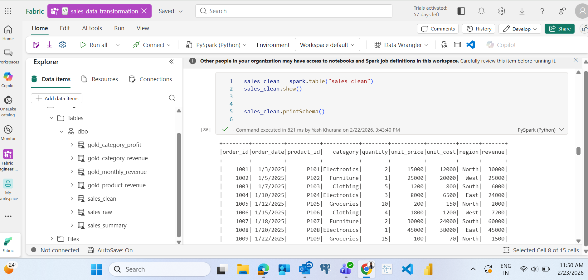
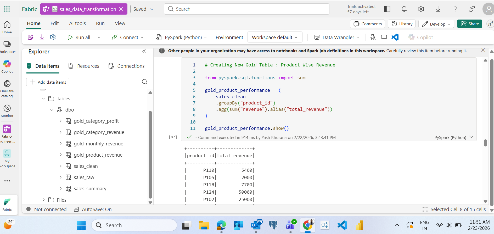
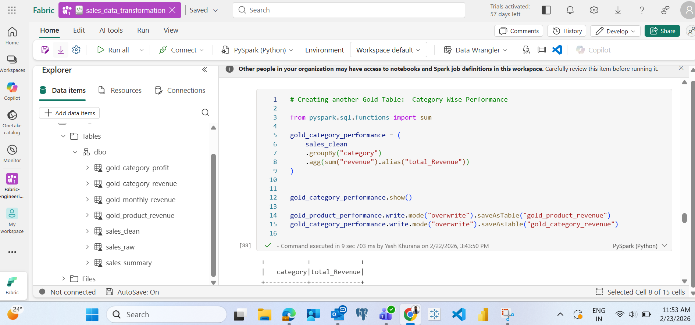
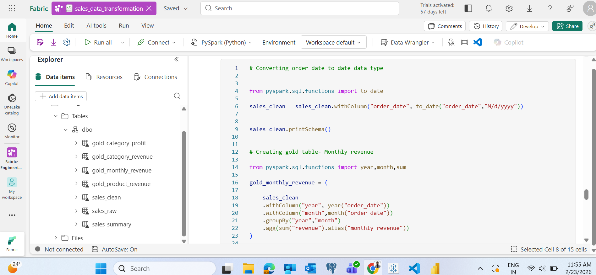
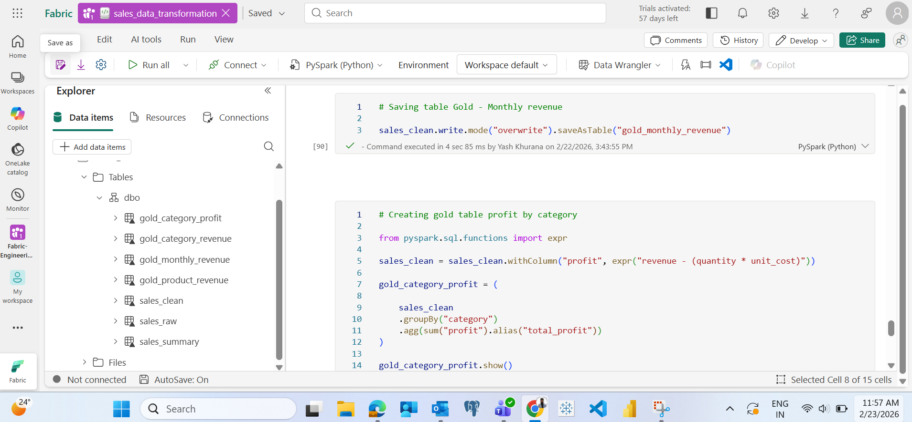
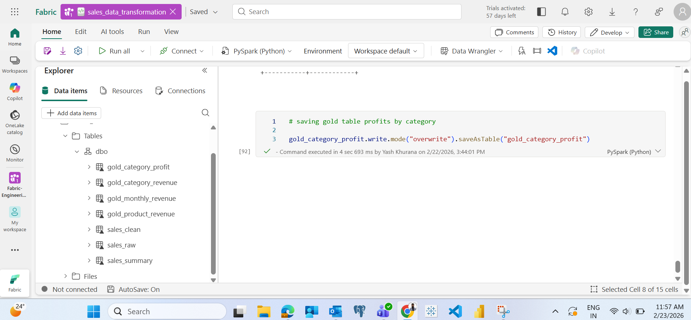
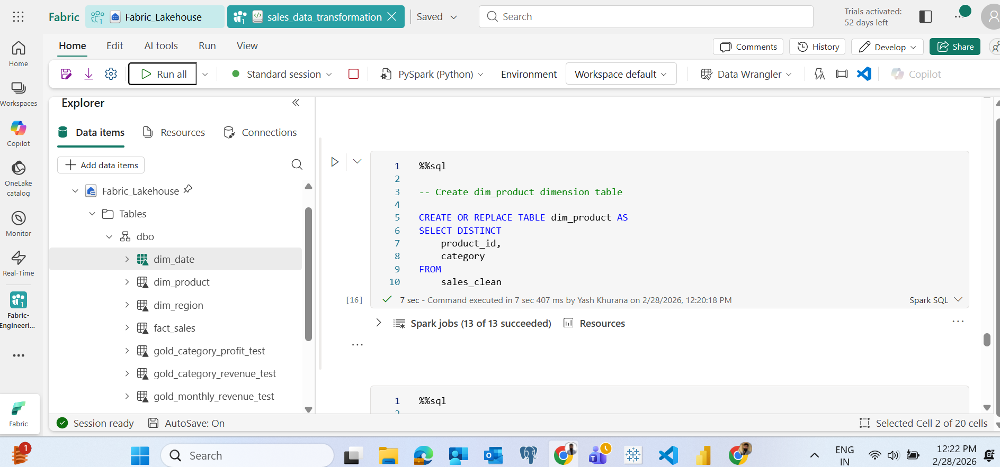
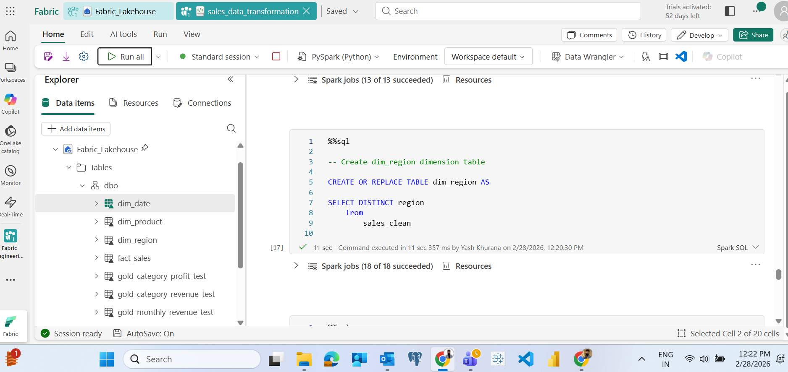
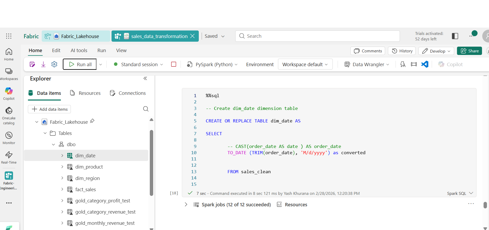
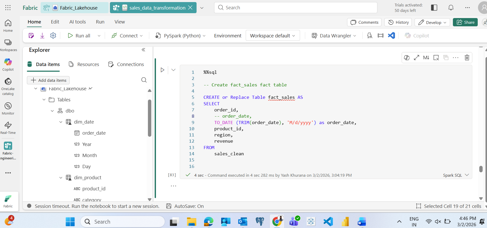

# Project 1 - Sales_Analytics ( Lakehouse Set Up)

# Objective

Build an end to end analytics solution using Microsoft Fabric starting with Lakehouse Ingestion.

# Architecture

CSV → Lakehouse → Transformation → Reporting

# Tools Used

- Microsoft Fabric
- Lakehouse
- Delta Table

# Dataset

Sales transaction dataset containing order details, price and region.

# Steps Performed:

1. Created Fabric Workspace
2. Created Lakehouse
3. Uploaded Raw CSV Data
4. Loaded Into Delta Table

# Screenshots

1. Created Lakehouse

2. Lakehouse Table

3. SQL Analytics Endpoint

4. Data Transformation ( Notebooks )
   - Removed invalid quantity
   - Removed null prices
   - Added revenue column

5. Raw data preview

   - 
  
6. Added revenue column

   - 
  
7. Cleaned Data Preview

   - 
  
8. Sales_Clean Table

   - 

9. Gold Layer ( Aggregated Sales Summary )

   - Created region wise revenue summary using Pyspark groupby and aggregation.
  
   ### Spark Aggregation

   - 
  
   - 
  
   - 

10. Read Sales Clean Table

   - 

11. Created Product Wise Revenue Table

    - 
   
12. Created Categort Wise Revenue Table

    - 

13. Created Monthly Revenue Table

    - 

14. Created Category Profit Table

    - 

15. Save Category Profit Table

    - 

# Now we will create Gold Layer ( Star Schema ) with the help of Spark SQL in notebook

We will create the following tables in gold layer:-
1) dim_date
2) dim_product
3) dim_region
4) fact_sales

We will follow the below steps:-

1) dim_product table

   - 

2) dim_region

    - 
  
3) dim_date

    - 
  
4) fact_sales

   - 

  
